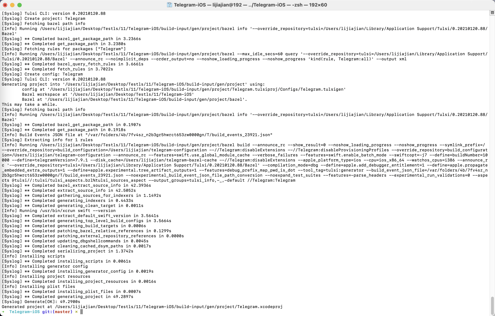
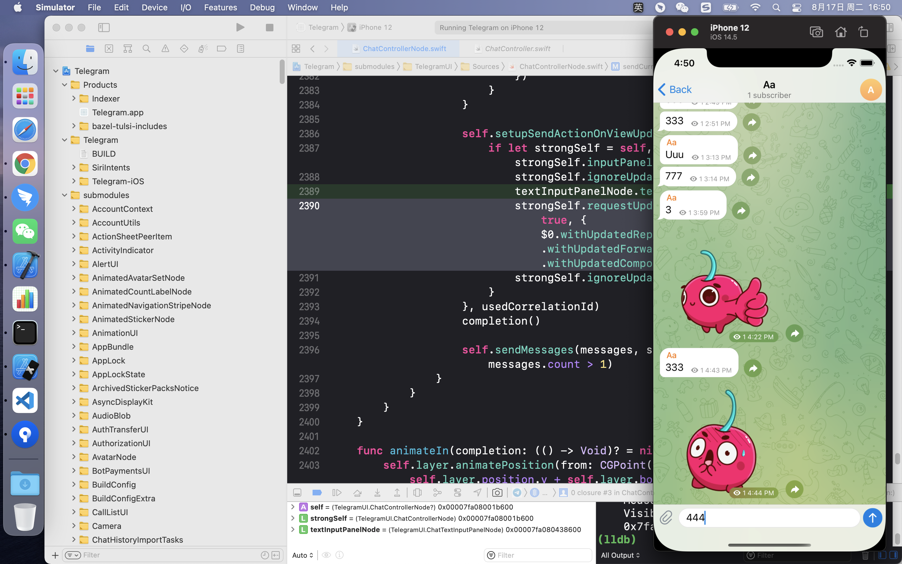

# IOS题目：
## 1、编译这个项目：https://github.com/TelegramMessenger/Telegram-iOS，了解基本运行原理 ，分析聊天消息的获取逻辑。

### 1. 采用 Bazel 编译构建 项目
1. 安装 Bazel 构建项目所需的软件包
2. 克隆项目（循环克隆git子项目 ）
3. 利用 Bazel 生成 Telegram.xcodeproj 完成后会自动打开 xcode 

    
    

### 2. 结构分析
1. 底层 MtProtoKit框架实现tcp 的数据传输
2. TelegramCore 封装核心业务逻辑

## 2、研究下这个项目分享逻辑 ：https://github.com/WhatsApp/stickers)，做一个基于网络图片分享的demo
虽然说是题目，但是不一定要做出来，有基本的分析思路也行

1. 网络请求图片，
2. 图片根据需求(压缩，裁剪等)缓存到内存或者本地存储
3. 将缓存的数据分享出去
